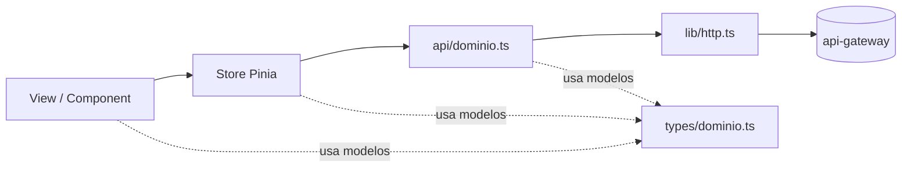
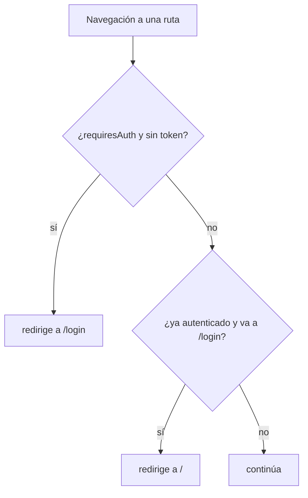

# crm-auth-frontend

Front de prueba (y base normalizada) del CRM en **Vue 3 + Vuetify + Pinia + Axios + Vite (TypeScript)**. Consume el backend **siempre a través del `api-gateway`**, nunca directo a un microservicio.

> **Propósito de este README:** es la **norma del proyecto**. Define la estructura, los nombres, cómo se hacen las peticiones, los modelos atados al backend y cómo se arman las rutas. Todo lo que se agregue debe seguir este molde: **nada queda en libertad**.

---

## Stack

| Pieza | Tecnología | Rol |
|-------|------------|-----|
| UI | Vue 3 (`<script setup>`) + Vuetify 3 | componentes y pantallas |
| Estado | Pinia (setup stores) | sesión y estado de dominio |
| Ruteo | Vue Router 4 | navegación + guards |
| HTTP | Axios | **único** cliente, con interceptores |
| Build | Vite 6 + TypeScript | dev server y bundling |

El front habla con `VITE_API_URL` = **el gateway** (`http://localhost:8080`), que valida el JWT y reenvía a los servicios.

---

## Principio de normalización

Tres reglas gobiernan todo el proyecto:

1. **Todo dato del backend tiene un modelo tipado** en `src/types/`, que **refleja el contrato** (OpenAPI) del servicio. El front nunca usa `any` para respuestas del API.
2. **Toda petición pasa por la capa `api/`**, que usa el cliente único `http`. Ningún componente ni store llama a `axios`/`fetch` directamente.
3. **Cada dominio se organiza igual**: `types → api → store → views/components → rutas`. Agregar una funcionalidad es rellenar ese molde, no inventar estructura.

---

## Estructura del proyecto

```
frontend/
├── index.html
├── .env / .env.example         # VITE_API_URL (gateway), VITE_GOOGLE_CLIENT_ID
├── vite.config.ts              # alias @ → src, puerto 5173
├── tsconfig.json / env.d.ts
└── src/
    ├── main.ts                 ✓ arranque: Vue + Pinia + Vuetify + router
    ├── App.vue                 ✓ shell (<v-app> + <router-view>)
    ├── lib/
    │   └── http.ts             ✓ cliente axios único (Bearer + refresh)
    ├── types/                  ← modelos por dominio (reflejan el backend)
    │   ├── api.ts                 forma de error estándar { code, message, details }
    │   └── auth.ts                modelos de auth (hoy viven en stores/auth.ts)
    ├── api/                    ← funciones de petición por dominio (usan http)
    │   └── auth.ts                register / login / google / refresh / logout / me
    ├── stores/                 ✓ estado Pinia por dominio
    │   └── auth.ts
    ├── router/                 ✓ rutas + guards
    │   └── index.ts
    ├── views/                  ✓ páginas de ruta (una carpeta por dominio al crecer)
    │   ├── AuthView.vue
    │   └── HomeView.vue
    └── components/             ← UI reutilizable (crear cuando haga falta)
```

`✓` = ya existe · `←` = parte del estándar; se crea al aplicar la norma / al crecer.

> Estado actual: el módulo `auth` es la **semilla**. Sus modelos están hoy dentro de `stores/auth.ts` y el store llama a `http` directo. El **estándar** (y hacia donde se alinea) es separar `types/auth.ts` (modelos) y `api/auth.ts` (peticiones). Todo dominio nuevo **nace ya separado**.

---

## Convenciones de nombres

| Elemento | Convención | Ejemplo |
|----------|------------|---------|
| Vista de ruta | PascalCase + sufijo `View` | `CustomerListView.vue` |
| Componente reutilizable | PascalCase | `MoneyField.vue` |
| Store | archivo `dominio.ts`, hook `useDominioStore` | `stores/customers.ts` → `useCustomersStore` |
| Capa API | `api/dominio.ts`, export `dominioApi` | `api/customers.ts` → `customersApi` |
| Modelos | `types/dominio.ts` | `types/customer.ts` |
| Ruta | path en kebab-case, `name` en minúscula | `/customers`, `name: 'customers'` |
| Variables de entorno | prefijo `VITE_` | `VITE_API_URL` |

---

## Capas y responsabilidades

El flujo de datos es siempre en una dirección:



| Capa | Responsabilidad | No hace |
|------|-----------------|---------|
| `types/` | Modelos que reflejan el contrato del backend | lógica |
| `api/` | Funciones de petición tipadas (usan `http`) | guardar estado, tocar UI |
| `stores/` | Estado + orquestación (llama a `api/`) | llamar a axios directo, renderizar |
| `views/` | Páginas de ruta, composición de UI | llamar a `http` directo |
| `components/` | UI reutilizable sin acoplarse a un store global | lógica de negocio |
| `lib/http.ts` | Cliente axios único: token, refresh, base URL | conocer dominios |

---

## Modelos ligados al backend

Los modelos del front **reflejan el contrato** de cada servicio (su `openapi.yaml`). Si el backend cambia el contrato, se actualiza el `types/` correspondiente — esa es la única fuente de verdad de las formas.

### Forma de error estándar (compartida)

Todos los servicios responden errores con `{ code, message, details? }`:

```ts
// src/types/api.ts
export interface ApiErrorDetail {
  field: string;
  message: string;
}

export interface ApiError {
  code: string;        // p.ej. 'INVALID_CREDENTIALS', 'VALIDATION_ERROR'
  message: string;     // legible por humanos
  details?: ApiErrorDetail[]; // presente en errores de validación (422)
}
```

### Modelos de auth (reflejan `auth-service/openapi.yaml`)

```ts
// src/types/auth.ts
export type AuthProvider = 'password' | 'google';

// Peticiones
export interface Credentials { email: string; password: string; } // register y login
export interface GoogleAuth { idToken: string; }

// Respuestas
export interface UserSummary {
  id: string;               // user_id (sub del JWT)
  email: string;
  emailVerified: boolean;
  authProvider: AuthProvider;
}

export interface TokenResponse {
  accessToken: string;
  tokenType: 'Bearer';
  expiresIn: number;        // segundos
  refreshToken: string;
  isNewUser?: boolean;      // presente en /auth/google
  user: UserSummary;
}

export interface Me {
  id: string;
  email: string;
  emailVerified: boolean;
  authProvider: AuthProvider;
  createdAt: string;        // ISO
}
```

**Regla:** cada endpoint del backend tiene su(s) tipo(s) de entrada y salida aquí. Nombres y campos **iguales** a los del `openapi.yaml` del servicio (camelCase como los devuelve el API).

---

## Cómo hacer peticiones

### Reglas

- **Nunca** uses `axios` o `fetch` directamente en componentes o stores. Siempre a través de la capa `api/`, que usa el cliente único `http`.
- **`baseURL` apunta al gateway** (`VITE_API_URL`), nunca a un servicio por su puerto.
- **No pongas el header `Authorization` a mano**: el interceptor de `http` lo inyecta desde el token guardado.
- **Errores**: usa la forma estándar `ApiError`. El manejo de `401` (refresh + reintento) es **global** en el interceptor; no lo repliques.

### La capa `api/` (patrón)

```ts
// src/api/auth.ts
import { http } from '@/lib/http';
import type { Credentials, GoogleAuth, Me, TokenResponse } from '@/types/auth';

export const authApi = {
  register: (body: Credentials) =>
    http.post<TokenResponse>('/auth/register', body).then((r) => r.data),
  login: (body: Credentials) =>
    http.post<TokenResponse>('/auth/login', body).then((r) => r.data),
  google: (body: GoogleAuth) =>
    http.post<TokenResponse>('/auth/google', body).then((r) => r.data),
  refresh: (refreshToken: string) =>
    http.post<TokenResponse>('/auth/refresh', { refreshToken }).then((r) => r.data),
  logout: (refreshToken: string) =>
    http.post<void>('/auth/logout', { refreshToken }).then((r) => r.data),
  me: () => http.get<Me>('/auth/me').then((r) => r.data),
};
```

### El cliente `http` (ya implementado en `lib/http.ts`)

- Adjunta `Authorization: Bearer <accessToken>` en cada request.
- En `401` (token expirado) llama a `/auth/refresh`, rota el token y **reintenta** la petición una vez; si el refresh falla, limpia sesión y manda a `/login`.
- Expone `setTokens`, `clearTokens`, `getAccessToken` para que el store gestione la sesión.

---

## Estado con Pinia

Un **store por dominio**, estilo *setup store*. Estructura fija: estado (`ref`) + getters (`computed`) + acciones (que llaman a la capa `api/`).

```ts
// patrón general de un store de dominio
export const useDominioStore = defineStore('dominio', () => {
  const items = ref<Modelo[]>([]);
  const loading = ref(false);
  const error = ref<string | null>(null);

  async function fetchAll() {
    loading.value = true; error.value = null;
    try { items.value = await dominioApi.list(); }
    catch (e) { error.value = extractError(e); throw e; }
    finally { loading.value = false; }
  }

  return { items, loading, error, fetchAll };
});
```

Convenciones: siempre exponer `loading` y `error`; las acciones capturan el error, lo guardan en `error` y lo re-lanzan para que la vista decida. Nada de llamar a `http` desde aquí — solo `api/`.

---

## Rutas web

### Reglas

- Rutas con `name`; paths en kebab-case.
- `meta.requiresAuth: true` para rutas privadas.
- `meta.permissions: ['recurso:accion']` para permisos finos (reflejan el RBAC de `identity-service`; se activan cuando el JWT lleve permisos).
- Vistas cargadas con **lazy loading** (`() => import(...)`) para dividir el bundle.
- Una carpeta de vistas por dominio: `views/customers/…`.

### Rutas actuales y cómo crecen

| Ruta | Nombre | Vista | Auth | Estado |
|------|--------|-------|------|--------|
| `/login` | `login` | `AuthView` | pública | ✓ |
| `/` | `home` | `HomeView` | `requiresAuth` | ✓ |
| `/customers` | `customers` | `views/customers/CustomerListView` | `requiresAuth` + `['customer:read']` | futuro |
| `/invoices` | `invoices` | `views/invoices/InvoiceListView` | `requiresAuth` + `['invoice:read']` | futuro |

Ejemplo de ruta normalizada (nuevo dominio, con lazy loading):

```ts
{
  path: '/customers',
  name: 'customers',
  component: () => import('@/views/customers/CustomerListView.vue'),
  meta: { requiresAuth: true, permissions: ['customer:read'] },
}
```

### Guard



El guard vive en `router/index.ts` y usa `getAccessToken()`. La verificación real del token la hace el gateway; el guard es solo UX.

---

## Autenticación y sesión

- **Tokens** en `localStorage` (`accessToken`, `refreshToken`), gestionados por `lib/http.ts`.
- **Access token** corto (15 min): se adjunta en cada request.
- **Refresh** transparente en `401`; si falla, sesión limpia y a `/login`.
- **Google Sign-In**: en `AuthView`, solo se muestra si `VITE_GOOGLE_CLIENT_ID` está configurado (el mismo Client ID que auth-service). Manda el ID Token a `POST /auth/google`.

---

## Variables de entorno

| Variable | Ejemplo | Descripción |
|----------|---------|-------------|
| `VITE_API_URL` | `http://localhost:8080` | URL del **gateway** (no de un servicio) |
| `VITE_GOOGLE_CLIENT_ID` | `xxxx.apps.googleusercontent.com` | opcional; habilita el botón de Google |

Toda variable expuesta al front lleva prefijo `VITE_`. Nunca pongas secretos aquí (el front es público).

---

## Componentes y UI

- **Vistas** (`views/`) = páginas de ruta. **Componentes** (`components/`) = piezas reutilizables.
- Vuetify como sistema de UI; usa sus componentes (`v-text-field`, `v-card`, …) y el tema definido en `main.ts`.
- Componentes de un dominio → `components/<dominio>/`; componentes verdaderamente genéricos → `components/`.
- Formularios: validación en el borde con las `:rules` de Vuetify; los errores del backend (`422`, `details[].field`) se mapean al campo correspondiente.

---

## Receta: agregar un nuevo dominio (p. ej. `customers`)

Seguir siempre estos pasos, en orden:

1. **Modelos** → `src/types/customer.ts`, reflejando el `openapi.yaml` de `customer-service`.
2. **Peticiones** → `src/api/customers.ts` con `customersApi` (usa `http`, tipa entradas y salidas).
3. **Estado** → `src/stores/customers.ts` (si necesita estado compartido), llamando a `customersApi`.
4. **Vistas** → `src/views/customers/…View.vue`.
5. **Componentes** → `src/components/customers/…` para lo reutilizable del dominio.
6. **Rutas** → registrar en `router/index.ts` con `meta.requiresAuth` y `meta.permissions`.

Si un paso no aplica (p. ej. un dominio sin estado global), se omite — pero el orden y los nombres no cambian.

---

## Scripts

```bash
npm install
npm run dev        # Vite en http://localhost:5173
npm run build      # bundle de producción (solo Vite; sin type-check)
npm run preview    # sirve el build
```

Requiere el backend corriendo: gateway en `:8080`, auth-service en `:3001`, MySQL. El CORS del gateway ya permite `http://localhost:5173`.

---

## Reglas de oro (resumen)

- El front habla **solo con el gateway** (`VITE_API_URL`), nunca con un servicio directo.
- **Cero `axios`/`fetch` sueltos**: todo pasa por `api/` sobre el cliente `http`.
- Cada respuesta del backend tiene su **modelo en `types/`**, fiel al `openapi.yaml`.
- Un **store por dominio**, con `loading` y `error`, llamando a `api/`.
- Rutas con `name`, `meta.requiresAuth`/`meta.permissions` y **lazy loading**.
- El `Authorization` y el refresh son **automáticos**; no se hacen a mano.
- Errores con forma estándar `{ code, message, details }`.
- Cada dominio nuevo sigue la **receta**: `types → api → store → views/components → rutas`.
